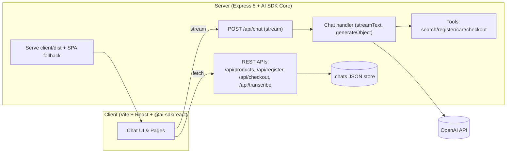
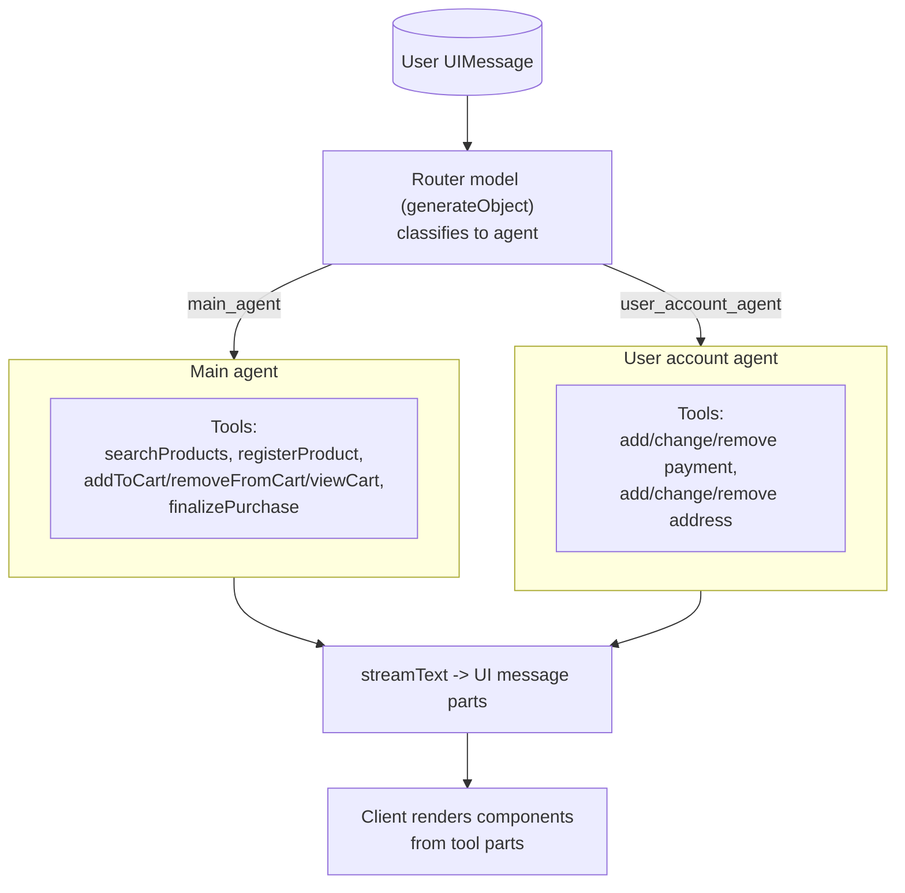

# ProcureFlow

ProcureFlow is an AI-powered procurement platform for enterprise materials and services management.

## Architecture overview

Monorepo with three packages:

- `client/` – Vite + React app (TypeScript, Tailwind, shadcn/ui) that talks to the API and renders a chat-driven, tool-augmented shopping flow.
- `server/` – Express 5 API that proxies AI calls, exposes product/search/cart endpoints, serves static files in production, and streams chat responses.
- `shared/types/` – Reusable TypeScript types shared by both client and server (e.g. `Product`, `Conversation`).

Runtime data flow:

1. The React client uses AI SDK UI (`@ai-sdk/react`) to send chat messages to `POST /api/chat` and render streamed responses (text, tool calls, tool results).
2. The server uses AI SDK Core (`ai`) with OpenAI (`@ai-sdk/openai`) to run the assistant, perform multi-step tool calling, and stream back UI-friendly messages.
3. Domain tools (search, cart, checkout, registration) are executed server-side; their results are rendered as UI components on the client.
4. Conversations are persisted as JSON files under `server/.chats/{id}.json` via a simple file store (`server/src/lib/chat-store.ts`).
5. In production, the server serves the built SPA from `client/dist` and provides an SPA fallback for non-`/api/*` routes.

### Diagram: application architecture



Key API routes (server):

- `GET /api/health` – health check
- `GET /api/products[?q=...]` – catalog search (text filter)
- `GET /api/products/:id` – product detail
- `POST /api/register` – mock product registration
- `POST /api/checkout` – mock checkout calculation
- `POST /api/chat` – AI assistant chat (streams UI message parts)
- `POST /api/transcribe` – audio transcription (OpenAI Whisper)
- `POST /api/chat/create` – create a new chat id
- `GET /api/chat/:id` – load chat history by id

## Stack and AI tools used

Frontend (client):

- Vite 5, React 18, TypeScript
- Tailwind CSS + `shadcn/ui` (Radix primitives)
- React Router
- AI SDK UI: `@ai-sdk/react` and `ai` transports for streaming chat

Backend (server):

- Express 5 on Bun/Node
- AI SDK Core: `streamText`, `generateObject`, `convertToModelMessages`
- OpenAI provider via `@ai-sdk/openai` (requires `OPENAI_API_KEY`)
- Busboy for multipart uploads (audio), Zod for schema validation, dotenv for env
- File-based chat persistence (`server/.chats`)

AI models & capabilities:

- Chat/completions: OpenAI models configured in `server/src/handlers/chat.ts` (adjust as needed for your account/models).
- Transcription: OpenAI Whisper (`whisper-1`) via `experimental_transcribe`.

Domain tools (server-executed with AI SDK):

- `searchProducts` – search catalog and return top matches
- `registerProduct` – register a new product into the mock catalog
- `addToCart`, `removeFromCart`, `viewCart` – cart intents returned to the client UI
- `addPaymentMethod`, `changePaymentMethod`, `removePaymentMethod` – payment method management intents
- `addShippingAddress`, `changeShippingAddress`, `removeShippingAddress` – address management intents
- `finalizePurchase` – signals client to present confirmation/summary

## Key design decisions and trade-offs

- Monorepo + shared types
	- Decision: colocate client, server, and shared types to eliminate drift and simplify refactors.
	- Trade-off: tighter coupling between packages; requires workspace tooling.

- Generative UI with tool calling
	- Decision: stream AI messages and typed tool parts to the client to render dynamic UI (cart, checkout, confirmations).
	- Trade-off: more moving pieces (typed parts, client rendering) but better UX and controllability vs. plain-text chat.

- Router + specialized agents
	- Decision: a lightweight router model first classifies each user message and selects a specialized agent (see `server/src/handlers/chat.ts`). Each agent has a focused system prompt and a small set of tools (e.g., `main_agent` for catalog/cart/checkout and `user_account_agent` for addresses/payment).
	- Trade-offs:
		- Cons: adds one extra model roundtrip for routing, increasing latency on first token for each user message.
		- Pros: allows using faster/cheaper models per agent, simpler prompts, fewer tools per context, better reliability, and lower cost at scale.

#### Diagram: router and agents



- File-based chat storage
	- Decision: simple JSON files under `server/.chats` for quick iteration.
	- Trade-off: not suitable for horizontal scale or durability; swap with a DB in production.

- Single server for API + static SPA (prod)
	- Decision: Express serves `client/dist` and provides SPA fallback.
	- Trade-off: simpler deploys; less flexibility than separate CDN + API services.


## Setup and run

Requirements

- Node.js (LTS)
- Bun (latest)

Environment

- `OPENAI_API_KEY` – required for `/api/chat` and `/api/transcribe` to work.
- Optional: `PORT` (defaults to `4000`) for the server.

Install (workspaces)

```sh
bun install
```

Develop

```sh
# Runs client and server concurrently
bun run dev

# Or run separately
bun run dev:client
bun run dev:server
```

Default dev URLs:

- Client (Vite): http://localhost:5173
- Server (API): http://localhost:4000 (all APIs under `/api/*`)

Build

```sh
bun run build
```

This builds:

- Client bundle to `client/dist`
- Server to `server/dist` with an entry shim at `server/dist/index.js`

Run production server locally

```sh
node server/dist/index.js
```

Notes

- SPA routing: non-`/api/*` routes fall back to `client/dist/index.html` so React Router can handle deep links.
- If you deploy behind another web server (NGINX, etc.), route `/api/*` to the Node/Express server and serve other paths from `client/dist` (or proxy to the same Express instance).
