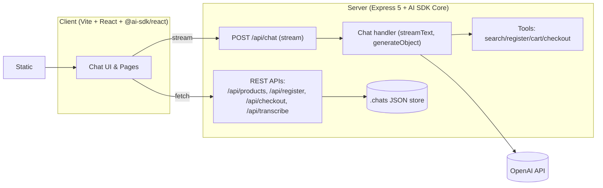
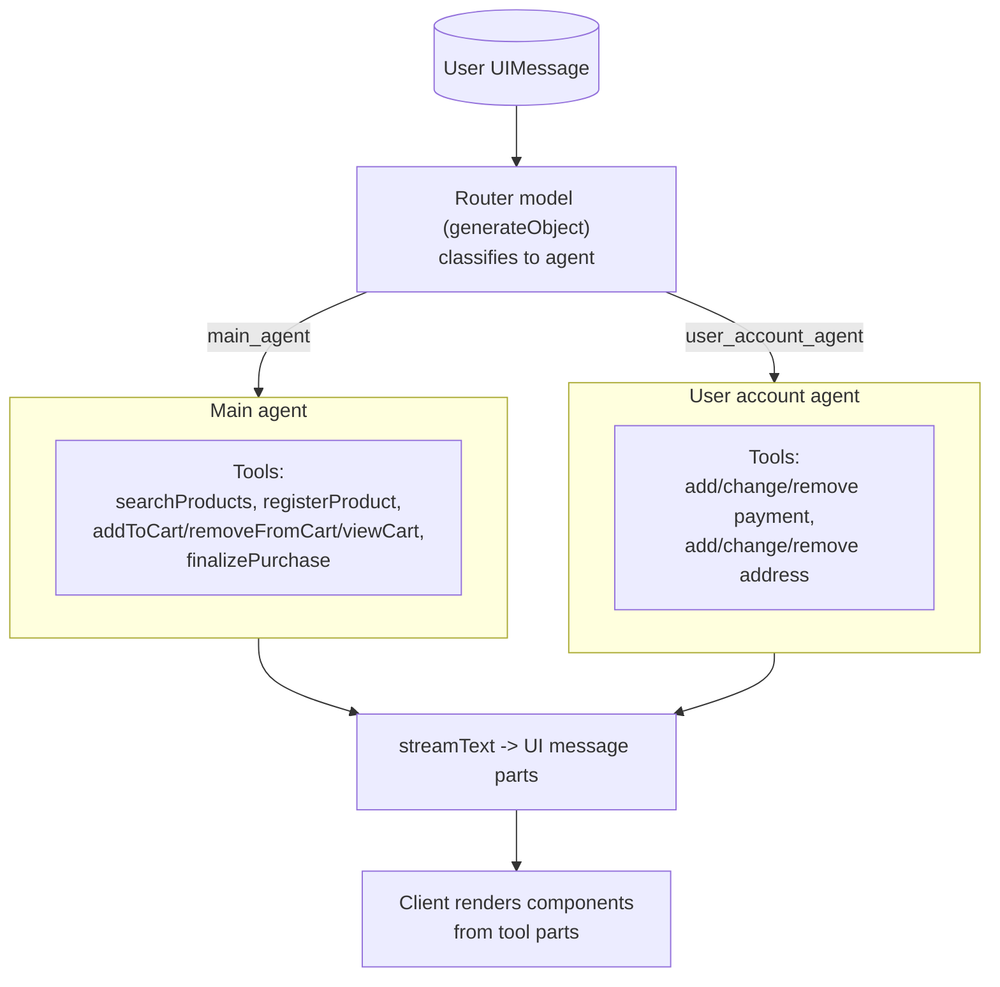

# ProcureFlow Case Demo

ProcureFlow is an AI-powered shopping assistant demo application built with a monorepo architecture using Vite + React for the frontend and Express 5 for the backend. It leverages the Vercel's AI SDK Core and UI libraries to create a chat interface that allows users to search for products, manage their cart, and finalize purchases through natural language interactions.

https://github.com/user-attachments/assets/7bb25080-4abe-4527-a715-670456d8086c

## Main features

- AI-powered chat interface shopping assistant
- Support for audio input via OpenAI Whisper
- The assistant can help users 
    - search for products
    - add items to cart
    - view cart contents
    - finalize purchases
    - manage payment methods and shipping addresses (even though the agent and tools exist, I did actually implment the data persistence for them and api endpoints)
- chat persistence as JSON files.
- UI components for cart, checkout, success messages inside the chat flow
- A demo search page /search with AI :sparkles: button overlay to start a chat minimized (just UI)

## Architecture overview

Monorepo with three packages:

- `client/` – Vite + React app (TypeScript, Tailwind, shadcn/ui) that talks to the API and renders a chat-driven, tool-augmented shopping flow.
- `server/` – Express 5 API that proxies AI calls, exposes product/search/cart endpoints, serves static files in production, and streams chat responses.
- `shared/types/` – Reusable TypeScript types shared by both client and server (e.g. `Product`, `Conversation`).

Runtime data flow:

1. The React client uses AI SDK UI (`@ai-sdk/react`) to send chat messages to `POST /api/chat` and render streamed responses (text, tool calls, tool results).
2. The server uses AI SDK Core (`ai`) with OpenAI (`@ai-sdk/openai`) to run the assistant, perform multi-step tool calling, and stream back UI-friendly messages.
3. Domain tools (search, cart, checkout, registration) are executed server-side; their results are rendered as UI components on the client.
4. Conversations are persisted as JSON files under `server/.chats/{id}.json` via a simple file store (`server/src/lib/chat-store.ts`).

## Application architecture



Key API routes (server):

- `GET /api/health` – health check
- `GET /api/products[?q=...]` – catalog search (text filter)
- `GET /api/products/:id` – product detail
- `POST /api/register` – mock product registration
- `POST /api/checkout` – mock checkout calculation
- `POST /api/chat` – AI assistant chat (streams UI message parts)
- `POST /api/transcribe` – audio transcription (OpenAI Whisper)
- `POST /api/chat/create` – create a new chat id
- `GET /api/chat/:id` – load chat history by id


## Agents architecture

The system uses a Router model to classify user messages and delegate them to specialized agents with focused toolsets.




## AI tools

The system uses typed, server-executed domain tools alongside client-side UI tool components:

- Server-side domain tools (executed by the AI agent via AI SDK Core)
	- Implement business logic and return typed "parts" that the client renders.
	- Live under `server/src/lib/tools/*` and are wired in `server/src/handlers/chat.ts`.
	- Examples: `searchProducts`, `registerProduct`, `addToCart`, `removeFromCart`, `viewCart`, `finalizePurchase`, and the user account tools for payment methods and shipping addresses.

- Client-side UI tool components (rendered in the chat stream)
	- Consume streamed tool "parts" and render interactive UI (cards, summaries, confirmations).
	- Live under `client/src/components/chat-tools/*` and `client/src/components/ai-elements/*`.
	- Examples: `InlineCartView`, `CheckoutSummary`, plus message/prompt/loader blocks that compose the chat experience.

How it fits together:

1. The assistant runs on the server and calls domain tools as needed (search, cart actions, checkout, etc.).
2. Tool results are streamed back as UI-friendly message parts.
3. The React client renders those parts using the UI tool components and collects any follow-up user input.

## Current limitations

- removeFromCart: not functioning yet.
- viewCart: renders the cart to the user, but the LLM currently does not have visibility into cart contents (it relies on the client UI to show them).
- Payments/addresses tools: add/change/remove payment methods and shipping addresses are placeholders and not wired to persistence, so they effectively don't work.

## Stack and AI tools used

Frontend (client):

- Vite 5, React 18, TypeScript
- Tailwind CSS + `shadcn/ui` (Radix primitives)
- React Router
- AI SDK UI: `@ai-sdk/react` and `ai` transports for streaming chat

Backend (server):

- Express 5 on Bun/Node
- AI SDK Core: `streamText`, `generateObject`, `convertToModelMessages`
- OpenAI provider via `@ai-sdk/openai` (requires `OPENAI_API_KEY`)
- Busboy for multipart uploads (audio), Zod for schema validation, dotenv for env
- File-based chat persistence (`server/.chats`)

AI models & capabilities:

- Chat/completions: OpenAI models configured in `server/src/handlers/chat.ts` (adjust as needed for your account/models).
- Transcription: OpenAI Whisper (`whisper-1`) via `experimental_transcribe`.

Domain tools (server-executed with AI SDK):

- `searchProducts` – search catalog and return top matches
- `registerProduct` – register a new product into the mock catalog
- `addToCart`, `removeFromCart`, `viewCart` – cart intents returned to the client UI
- `addPaymentMethod`, `changePaymentMethod`, `removePaymentMethod` – payment method management intents
- `addShippingAddress`, `changeShippingAddress`, `removeShippingAddress` – address management intents
- `finalizePurchase` – signals client to present confirmation/summary

## Key design decisions and trade-offs

- Monorepo + shared types
	- Decision: colocate client, server, and shared types to eliminate drift and simplify refactors.
	- Trade-off: tighter coupling between packages; requires workspace tooling.

- Generative UI with tool calling
	- Decision: stream AI messages and typed tool parts to the client to render dynamic UI (cart, checkout, confirmations).
	- Trade-off: more moving pieces (typed parts, client rendering) but better UX and controllability vs. plain-text chat.

- Router + specialized agents
	- Decision: a lightweight router model first classifies each user message and selects a specialized agent (see `server/src/handlers/chat.ts`). Each agent has a focused system prompt and a small set of tools (e.g., `main_agent` for catalog/cart/checkout and `user_account_agent` for addresses/payment).
	- Trade-offs:
		- Cons: adds one extra model roundtrip for routing, increasing latency on first token for each user message.
		- Pros: allows using faster/cheaper models per agent, simpler prompts, fewer tools per context, better reliability, and lower cost at scale.


- The main page is the chat interface. The /search page is a secondary page with a button to start a chat minimized (but right now, it is just the UI, no functionality).
    - Decision: keep the chat as the primary interface to showcase the AI assistant capabilities, with a secondary search page for additional functionality.
    - Trade-off: simpler user experience focused on chat, but may limit discoverability of other features.

- File-based chat storage
	- Decision: simple JSON files under `server/.chats` for quick iteration.
	- Trade-off: not suitable for horizontal scale or durability; swap with a DB in production.

- Product search endpoint (`GET /api/products` in `server/src/index.ts`)
	- Decision: implement a lightweight in-memory search that linearly filters an array of `Product` objects via `filterProductsByQuery` (simple `includes` / field matching) and returns a normalized shape to the client. Keeps zero external dependencies and works instantly on small catalogs.
	- Trade-offs:
		- Pros: extremely fast to prototype, no indexing step, trivial to extend with a couple more fields; stable and predictable results (no fuzzy ranking surprises).
		- Cons: O(n) scan per request, limited relevance quality (no stemming, typo tolerance, weighting, semantic matching), and memory-bound scaling. For larger catalogs this becomes latency-sensitive and prevents advanced UX (facets, semantic suggestions).
		- Future improvements: introduce an indexed store (e.g. Postgres + trigram/fts, Meilisearch, or Elasticsearch) for full-text + filters; add fuzzy/typo tolerance; optionally layer semantic/vector search (e.g. OpenAI embeddings / pgvector) to handle intent-driven queries ("durable lightweight laptop"). The current endpoint shape can evolve by adding ranking metadata (score) and facets without breaking clients if fields are optional.


## Setup and run

Requirements

- Node.js (LTS)
- Bun (latest)

Environment

- `OPENAI_API_KEY` – required for `/api/chat` and `/api/transcribe` to work.
- Optional: `PORT` (defaults to `4000`) for the server.

Environment file

- Location: create a `.env` file in `server/.env` (loaded by `dotenv` in the server).
- Starter template: `server/.env.example`.
- Quick setup:

```sh
# copy the template and fill in your key
cp server/.env.example server/.env
# then edit server/.env and set OPENAI_API_KEY
```

Notes

- The API key is used only on the server; it is not required in the client app.
- Do not commit your `.env` file.

Install (workspaces)

```sh
bun install
```

Develop

```sh
# Runs client and server concurrently
bun run dev

# Or run separately
bun run dev:client
bun run dev:server
```

Default dev URLs:

- Client (Vite): http://localhost:5173
- Server (API): http://localhost:4000 (all APIs under `/api/*`)

Build

```sh
bun run build
```

This builds:

- Client bundle to `client/dist`
- Server to `server/dist` with an entry shim at `server/dist/index.js`

Run production server locally

```sh
node server/dist/index.js
```
